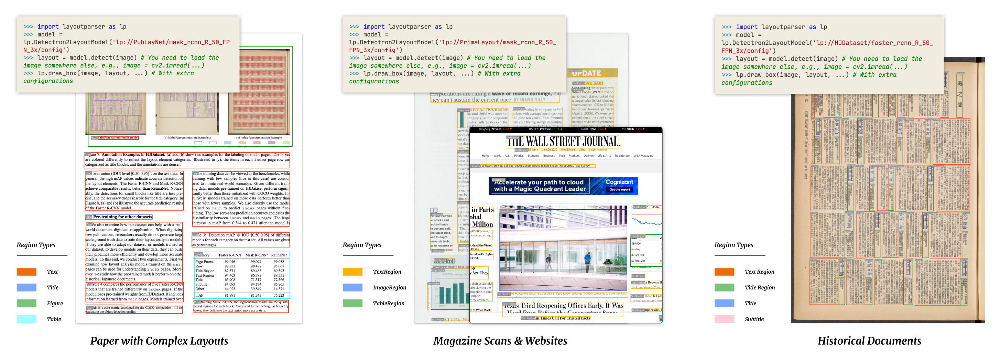

<p align="center">
  
  <p align="center">
  A unified toolkit for Deep Learning Based Document Image Analysis
  </p>
</p>

<p align=center>
<a href="https://arxiv.org/abs/2103.15348"></a>
<a href="https://layout-parser.github.io"></a>
<a href="https://layout-parser.readthedocs.io/en/latest/"></a>
</p>

<p align=center>
<a href="https://pypi.org/project/layoutparser/"></a>
<a href="https://pypi.org/project/layoutparser/"></a>

<a href="https://github.com/Layout-Parser/layout-parser/blob/master/LICENSE"></a>
</p>

---

## Installation 

You can find detailed installation instructions in [installation.md](installation.md). But generally, it's just `pip install` 
some libraries: 

```bash
pip install -U layoutparser

# Install Detectron2 for using DL Layout Detection Model
# Please make sure the PyTorch version is compatible with
# the installed Detectron2 version. 
pip install 'git+https://github.com/facebookresearch/detectron2.git@v0.4#egg=detectron2' 

# Install the ocr components when necessary 
pip install layoutparser[ocr]      
```

**For Windows Users:** Please read [installation.md](installation.md) for details about installing Detectron2.

## Quick Start

We provide a series of examples for to help you start using the layout parser library: 

1. [Table OCR and Results Parsing](https://github.com/Layout-Parser/layout-parser/blob/master/examples/OCR%20Tables%20and%20Parse%20the%20Output.ipynb): `layoutparser` can be used for conveniently OCR documents and convert the output in to structured data. 

2. [Deep Layout Parsing Example](https://github.com/Layout-Parser/layout-parser/blob/master/examples/Deep%20Layout%20Parsing.ipynb): With the help of Deep Learning, `layoutparser` supports the analysis very complex documents and processing of the hierarchical structure in the layouts. 


## DL Assisted Layout Prediction Example 



*The images shown in the figure above are: a screenshot of [this paper](https://arxiv.org/abs/2004.08686), an image from the [PRIMA Layout Analysis Dataset](https://www.primaresearch.org/dataset/), a screenshot of the [WSJ website](http://wsj.com), and an image from the [HJDataset](https://dell-research-harvard.github.io/HJDataset/).*

With only 4 lines of code in `layoutparse`, you can unlock the information from complex documents that existing tools could not provide. You can either choose a deep learning model from the [ModelZoo](https://github.com/Layout-Parser/layout-parser/blob/master/docs/notes/modelzoo.md), or load the model that you trained on your own. And use the following code to predict the layout as well as visualize it: 

```python
>>> import layoutparser as lp
>>> model = lp.Detectron2LayoutModel('lp://PrimaLayout/mask_rcnn_R_50_FPN_3x/config')
>>> layout = model.detect(image) # You need to load the image somewhere else, e.g., image = cv2.imread(...)
>>> lp.draw_box(image, layout,) # With extra configurations
```

## Contributing

We encourage you to contribute to Layout Parser! Please check out the [Contributing guidelines](.github/CONTRIBUTING.md) for guidelines about how to proceed. Join us!

## Web Demo
* [Gradio](https://gradio.app/g/AK391/layout-parser)

## Citing `layoutparser`

If you find `layoutparser` helpful to your work, please consider citing our tool and [paper](https://arxiv.org/pdf/2103.15348.pdf) using the following BibTeX entry.

```
@article{shen2021layoutparser,
  title={LayoutParser: A Unified Toolkit for Deep Learning Based Document Image Analysis},
  author={Shen, Zejiang and Zhang, Ruochen and Dell, Melissa and Lee, Benjamin Charles Germain and Carlson, Jacob and Li, Weining},
  journal={arXiv preprint arXiv:2103.15348},
  year={2021}
}
```