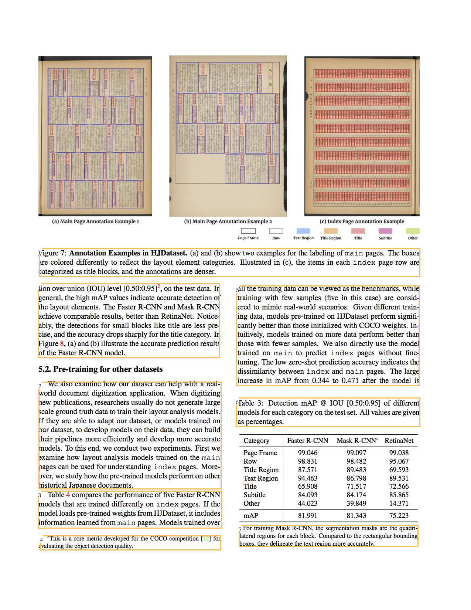

Deep Layout Parsing
===================

In this tutorial, we will show how to use the ``layoutparser`` API to

1. Load Deep Learning Layout Detection models and predict the layout of
   the paper image
2. Use the coordinate system to parse the output

The ``paper-image`` is from https://arxiv.org/abs/2004.08686.

.. code:: python

    import layoutparser as lp
    import cv2

Use Layout Models to detect complex layout
------------------------------------------

``layoutparser`` can identify the layout of the given document with only
4 lines of code.

.. code:: python

    image = cv2.imread("data/paper-image.jpg")
    image = image[..., ::-1] 
        # Convert the image from BGR (cv2 default loading style)
        # to RGB

.. code:: python

    model = lp.models.Detectron2LayoutModel('lp://PubLayNet/faster_rcnn_R_50_FPN_3x/config', 
                                     extra_config=["MODEL.ROI_HEADS.SCORE_THRESH_TEST", 0.8],
                                     label_map={0: "Text", 1: "Title", 2: "List", 3:"Table", 4:"Figure"})
        # Load the deep layout model from the layoutparser API 
        # For all the supported model, please check the Model 
        # Zoo Page: https://layout-parser.readthedocs.io/en/latest/notes/modelzoo.html

.. code:: python

    layout = model.detect(image)
        # Detect the layout of the input image

.. code:: python

    lp.draw_box(image, layout, box_width=3)
        # Show the detected layout of the input image

Check the results from the model
--------------------------------

.. code:: python

    type(layout)         

.. parsed-literal::

    layoutparser.elements.Layout

The ``layout`` variables is a ``Layout`` instance, which is inherited
from list and supports handy methods for layout processing.

.. code:: python

    layout[0]

.. parsed-literal::

    TextBlock(block=Rectangle(x_1=646.4182739257812, y_1=1420.1715087890625, x_2=1132.8687744140625, y_2=1479.7222900390625), text=, id=None, type=Text, parent=None, next=None, score=0.9996440410614014)

``layout`` contains a series of ``TextBlock``\ s. They store the
coordinates in the ``.block`` variable and other information of the
blocks like block type in ``.type``, text in ``.text``, etc. More
information can be found at the
`documentation <https://layout-parser.readthedocs.io/en/latest/api_doc/elements.html#layoutparser.elements.TextBlock>`__.

Use the coordinate system to process the detected layout
--------------------------------------------------------

Firstly we filter text region of specific type:

.. code:: python

    text_blocks = lp.Layout([b for b in layout if b.type=='Text'])
    figure_blocks = lp.Layout([b for b in layout if b.type=='Figure'])

As there could be text region detected inside the figure region, we just
drop them:

.. code:: python

    text_blocks = lp.Layout([b for b in text_blocks \
                       if not any(b.is_in(b_fig) for b_fig in figure_blocks)])

Finally sort the text regions and assign ids:

.. code:: python

    h, w = image.shape[:2]
    
    left_interval = lp.Interval(0, w/2*1.05, axis='x').put_on_canvas(image)
    
    left_blocks = text_blocks.filter_by(left_interval, center=True)
    left_blocks.sort(key = lambda b:b.coordinates[1], inplace=True)
    
    right_blocks = [b for b in text_blocks if b not in left_blocks]
    right_blocks.sort(key = lambda b:b.coordinates[1], inplace=True)
    
    # And finally combine the two list and add the index
    # according to the order
    text_blocks = lp.Layout([b.set(id = idx) for idx, b in enumerate(left_blocks + right_blocks)])

Visualize the cleaned text blocks:

.. code:: python

    lp.draw_box(image, text_blocks,
                box_width=3, 
                show_element_id=True)

Fetch the text inside each text region
---------------------------------------

We can also combine with the OCR functionality in ``layoutparser`` to
fetch the text in the document.

.. code:: python

    ocr_agent = lp.TesseractAgent(languages='eng') 
        # Initialize the tesseract ocr engine. You might need 
        # to install the OCR components in layoutparser:
        # pip install layoutparser[ocr]

.. code:: python

    for block in text_blocks:
        segment_image = (block
                           .pad(left=5, right=5, top=5, bottom=5)
                           .crop_image(image))
            # add padding in each image segment can help
            # improve robustness 
            
        text = ocr_agent.detect(segment_image)
        block.set(text=text, inplace=True)

.. code:: python

    for txt in text_blocks.get_texts():
        print(txt, end='\n---\n')

.. parsed-literal::

    Figure 7: Annotation Examples in HJDataset. (a) and (b) show two examples for the labeling of main pages. The boxes
    are colored differently to reflect the layout element categories. Illustrated in (c), the items in each index page row are
    categorized as title blocks, and the annotations are denser.
    ---
    tion over union (IOU) level [0.50:0.95]’, on the test data. In
    general, the high mAP values indicate accurate detection of
    the layout elements. The Faster R-CNN and Mask R-CNN
    achieve comparable results, better than RetinaNet. Notice-
    ably, the detections for small blocks like title are less pre-
    cise, and the accuracy drops sharply for the title category. In
    Figure 8, (a) and (b) illustrate the accurate prediction results
    of the Faster R-CNN model.
    ---
    We also examine how our dataset can help with
    world document digitization application. When digitizing
    new publications, researchers usually do not generate large
    scale ground truth data to train their layout analysis models.
    If they are able to adapt our dataset, or models trained on
    our dataset, to develop models on their data, they can build
    their pipelines more efficiently and develop more accurate
    models. To this end, we conduct two experiments. First we
    examine how layout analysis models trained on the main
    pages can be used for understanding index pages. More-
    over, we study how the pre-trained models perform on other
    historical Japanese documents.
    ---
    Table 4 compares the performance of five Faster R-CNN
    models that are trained differently on index pages. If the
    model loads pre-trained weights from HJDataset, it includes
    information learned from main pages. Models trained over
    ---
    ?This is a core metric developed for the COCO competition [| 2] for
    evaluating the object detection quality.
    ---
    all the training data can be viewed as the benchmarks, while
    training with few samples (five in this case) are consid-
    ered to mimic real-world scenarios. Given different train-
    ing data, models pre-trained on HJDataset perform signifi-
    cantly better than those initialized with COCO weights. In-
    tuitively, models trained on more data perform better than
    those with fewer samples. We also directly use the model
    trained on main to predict index pages without fine-
    tuning. The low zero-shot prediction accuracy indicates the
    dissimilarity between index and main pages. The large
    increase in mAP from 0.344 to 0.471 after the model is
    ---
    Table 3: Detection mAP @ IOU [0.50:0.95] of different
    models for each category on the test set. All values are given
    as percentages.
    ---
    * For training Mask R-CNN, the segmentation masks are the quadri-
    lateral regions for each block. Compared to the rectangular bounding
    boxes, they delineate the text region more accurately.
    ---

