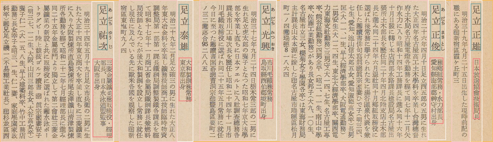

Deep Layout Parsing
===================

In this tutorial, we will show how to use the ``layoutparser`` API to

1. Load Deep Learning Layout Detection models and predict the layout of
   the input image
2. Use the coordinate system to parse the output

The test images are from the
`HJDataset <https://dell-research-harvard.github.io/HJDataset/>`__,
which contains noisy historical scans with complex layouts.

.. code:: python

    import layoutparser as lp
    import cv2

Use Layout Models to detect complex layout
------------------------------------------

``layoutparser`` can identify the layout of the given document with only
4 lines of code.

.. code:: python

    image = cv2.imread("data/HJData-test-image.jpg")
    image = image[..., ::-1] 
        # Convert the image from BGR (cv2 default loading style)
        # to RGB

.. code:: python

    model = lp.Detectron2LayoutModel('lp://HJDataset/faster_rcnn_R_50_FPN_3x/config',
                                     extra_config=["TEST.DETECTIONS_PER_IMAGE", "120"])
        # Load the deep layout model from the layoutparser API 
        # For all the supported model, please check the Model 
        # Zoo Page: https://layout-parser.readthedocs.io/en/latest/notes/modelzoo.html
    
    layout = model.detect(image)
        # Detect the layout of the input image

.. code:: python

    lp.draw_box(image, layout, box_width=6)
        # Show the detected layout of the input image

.. image:: output_6_0.png

Check the results from the model
--------------------------------

.. code:: python

    type(layout)         

.. parsed-literal::

    layoutparser.elements.Layout

The ``layout`` variables is a ``Layout`` instance, which is inherited
from list and supports handy methods for layout processing.

.. code:: python

    layout[0]

.. parsed-literal::

    TextBlock(block=Rectangle(x_1=182.01585388183594, y_1=777.922607421875, x_2=2053.8076171875, y_2=1318.0374755859375), text=, id=None, type=2, parent=None, next=None, score=0.9999566078186035)

``layout`` contains a series of ``TextBlock``\ s. They store the
coordinates in the ``.block`` variable and other information of the
blocks like block type in ``.type``, text in ``.text``, etc. More
information can be found at the
`documentation <https://layout-parser.readthedocs.io/en/latest/api_doc/elements.html#layoutparser.elements.TextBlock>`__.

Use the coordinate system to process the detected layout
--------------------------------------------------------

.. code:: python

    row_blocks = [b for b in layout if b.type == 2] 
        # 2 is the class for the row boxes 
    row_block  = row_blocks[0]
        # Choose the first row block as an example
    row_image  = row_block.crop_image(image)
        # Crop out the row image 
    row_layout = layout.\
                    filter_by(row_block, center=True).\
                    relative_to(row_block)
        # In layout, find all the blocks in the row region, 
        # and transform their coordinates into relative 
        # coordinates to the row box

.. code:: python

    lp.draw_box(row_image, row_layout, box_width=3)

