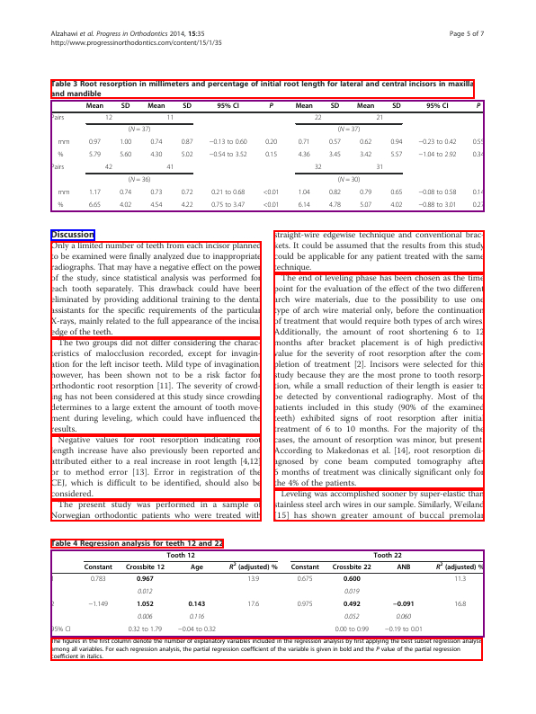
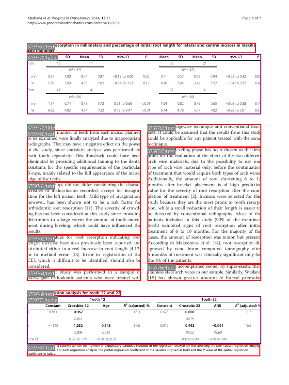
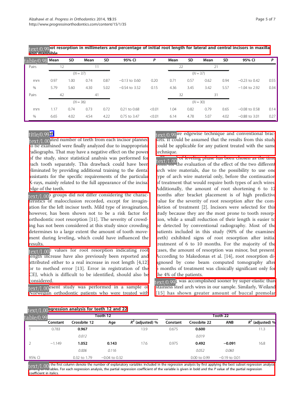

Load COCO Layout Annotations
==============================================================

Preparation
-----------

In this notebook, I will illustrate how to use LayoutParser to load and
visualize the layout annotation in the COCO format.

Before starting, please remember to download PubLayNet annotations and
images from their
`website <https://dax-cdn.cdn.appdomain.cloud/dax-publaynet/1.0.0/PubLayNet.html>`__
(let’s just use the validation set for now as the training set is very
large). And let’s put all extracted files in the
``data/publaynet/annotations`` and ``data/publaynet/val`` folder.

And we need to install an additional library for conveniently handling
the COCO data format:

.. code:: bash

   pip install pycocotools

OK - Let’s get on the code:

Loading and visualizing layouts using Layout-Parser
---------------------------------------------------

.. code:: python

    from pycocotools.coco import COCO
    import layoutparser as lp
    import random 
    import cv2

.. code:: python

    def load_coco_annotations(annotations, coco=None):
        """
        Args:
            annotations (List): 
                a list of coco annotaions for the current image 
            coco (`optional`, defaults to `False`):  
                COCO annotation object instance. If set, this function will 
                convert the loaded annotation category ids to category names 
                set in COCO.categories
        """
        layout = lp.Layout()
    
        for ele in annotations:
    
            x, y, w, h = ele['bbox']
    
            layout.append(
                lp.TextBlock(
                    block = lp.Rectangle(x, y, w+x, h+y),
                    type  = ele['category_id'] if coco is None else coco.cats[ele['category_id']]['name'],
                    id = ele['id']
                )
            )
        
        return layout 

The ``load_coco_annotations`` function will help convert COCO
annotations into the layoutparser objects.

.. code:: python

    COCO_ANNO_PATH = 'data/publaynet/annotations/val.json'
    COCO_IMG_PATH  = 'data/publaynet/val'
    
    coco = COCO(COCO_ANNO_PATH)

.. parsed-literal::

    loading annotations into memory...
    Done (t=1.17s)
    creating index...
    index created!

.. code:: python

    color_map = {
        'text':   'red',
        'title':  'blue',
        'list':   'green',
        'table':  'purple',
        'figure': 'pink',
    }
    
    
    for image_id in random.sample(coco.imgs.keys(), 1):
        image_info = coco.imgs[image_id]
        annotations = coco.loadAnns(coco.getAnnIds([image_id]))
        
        image = cv2.imread(f'{COCO_IMG_PATH}/{image_info["file_name"]}')
        layout = load_coco_annotations(annotations, coco)
        
        viz = lp.draw_box(image, layout, color_map=color_map)
        display(viz) # show the results 

You could add more information in the visualization.

.. code:: python

    lp.draw_box(image, 
                  [b.set(id=f'{b.id}/{b.type}') for b in layout],
                  color_map=color_map,
                  show_element_id=True, id_font_size=10, 
                  id_text_background_color='grey',
                  id_text_color='white')

Model Predictions on loaded data
--------------------------------

We could also check how the trained layout model performs on the input
image. Following this
`instruction <https://github.com/Layout-Parser/layout-parser/blob/master/examples/Deep%20Layout%20Parsing.ipynb>`__,
we could conveniently load a layout prediction model and run predictions
on the existing image.

.. code:: python

    model = lp.Detectron2LayoutModel('lp://PubLayNet/faster_rcnn_R_50_FPN_3x/config',
                                     extra_config=["MODEL.ROI_HEADS.SCORE_THRESH_TEST", 0.8],
                                     label_map={0: "text", 1: "title", 2: "list", 3:"table", 4:"figure"})

.. code:: python

    layout_predicted = model.detect(image)

.. code:: python

    lp.draw_box(image, 
                  [b.set(id=f'{b.type}/{b.score:.2f}') for b in layout_predicted],
                  color_map=color_map,
                  show_element_id=True, id_font_size=10, 
                  id_text_background_color='grey',
                  id_text_color='white')

