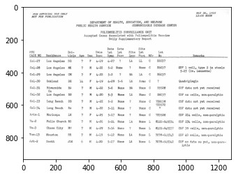
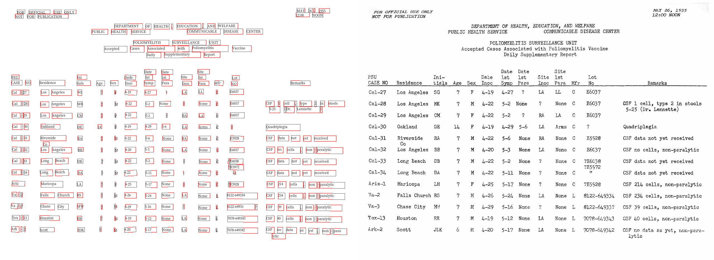
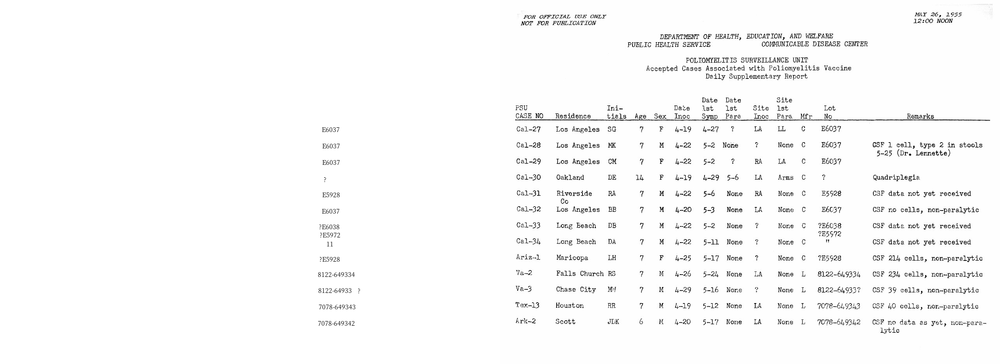

OCR tables and parse the output
===============================

In this tutorial, we will illustrate how easily the ``layoutparser``
APIs can be used for

1. Recognizing texts in images and store the results with the specified
   OCR engine
2. Postprocessing of the textual results to create structured data

.. code:: python

    import layoutparser as lp 
    
    import matplotlib.pyplot as plt
    %matplotlib inline 
    
    import pandas as pd
    import numpy as np
    import cv2

Initiate GCV OCR engine and check the image
-------------------------------------------

Currently, ``layoutparser`` supports two types of OCR engines: Google
Cloud Vision and Tesseract OCR engine. And we are going to provide more
support in the future. In this toturial, we will use the Google Cloud
Vision engine as an example.

.. code:: python

    ocr_agent = lp.GCVAgent.with_credential("<path/to/your/credential>",
                                           languages = ['en'])

The ``language_hints`` tells the GCV which langeuage shall be used for
OCRing. For a detailed explanation, please check
`here <https://cloud.google.com/vision/docs/languages>`__.

The ``example-table`` is a scan with complicated table structures from
https://stacks.cdc.gov/view/cdc/42482/.

.. code:: python

    image = cv2.imread('data/example-table.jpeg')
    plt.imshow(image);

Load images and send for OCR
----------------------------

The ``ocr_agent.detect`` method can take the image array, or simply the
path of the image, for OCR. By default it will return the text in the
image, i.e., ``text = ocr_agent.detect(image)``.

However, as the layout is complex, the text information is not enough:
we would like to directly analyze the response from GCV Engine. We can
set the ``return_response`` to ``True``. This feature is also supported
for other OCR Engines like ``TesseractOCRAgent``.

.. code:: python

    res = ocr_agent.detect(image, return_response=True)
    
    # Alternative
    # res = ocr_agent.detect('data/example-table.jpeg', return_response=True) 

Parse the OCR output and visualize the layout
---------------------------------------------

As defined by GCV, there are two different types of output in the
response:

1. text_annotations:

   | In this format, GCV automatically find the best aggregation level
     for the text, and return the results in a list. We can
   | use the ``ocr_agent.gather_text_annotations`` to reterive this type
     of information.

2. full_text_annotations

   To support better user control, GCV also provides the
   ``full_text_annotation`` output, where it returns the hierarchical
   structure of the output text. To process this output, we provide the
   ``ocr_agent.gather_full_text_annotation`` function to aggregate the
   texts of the given aggregation level.

   There are 5 levels specified in ``GCVFeatureType``, namely: ``PAGE``,
   ``BLOCK``, ``PARA``, ``WORD``, ``SYMBOL``.

.. code:: python

    texts  = ocr_agent.gather_text_annotations(res) 
        # collect all the texts without coordinates
    layout = ocr_agent.gather_full_text_annotation(res, agg_level=lp.GCVFeatureType.WORD)
        # collect all the layout elements of the `WORD` level

And we can use the ``draw_box`` or ``draw_text`` functions to quickly
visualize the detected layout and text information.

These functions are highly customizable. You can change styles of the
drawn boxes and texts easily. Please check the
`documentation <https://layout-parser.readthedocs.io/en/latest/api_doc/visualization.html#layoutparser.visualization.draw_text>`__
for the detailed explanation of the configurable parameters.

As shown below, the ``draw_text`` function generates a visualization
that:

1. it draws the detected layout with text on the left side and shows the
   original image on the right canvas for comparison.
2. on the text canvas (left), it also draws a red bounding box for each
   text region.

.. code:: python

    lp.draw_text(image, layout, font_size=12, with_box_on_text=True,
                 text_box_width=1)

Filter the returned text blocks
-------------------------------

We find the coordinates of residence column are in the range of
:math:`y\in(300,833)` and :math:`x\in(132, 264)`. The
``layout.filter_by`` function can be used to fetch the texts in the
region.

Note: As the OCR engine usually does not provide advanced functions like
table detection, the coordinates are found manually by using some image
inspecting tools like GIMP.

.. code:: python

    filtered_residence = layout.filter_by(
        lp.Rectangle(x_1=132, y_1=300, x_2=264, y_2=840)
    )
    lp.draw_text(image, filtered_residence, font_size=16)

.. image:: output_17_0.png

And similarily, we can do that for the ``lot_number`` column. As
sometimes there could be irregularities in the layout as well as the OCR
outputs, the ``layout.filter_by`` function also supports a
``soft_margin`` argument to handle this issue and generate more robust
outputs.

.. code:: python

    filter_lotno = layout.filter_by(
        lp.Rectangle(x_1=810, y_1=300, x_2=910, y_2=840),
        soft_margin = {"left":10, "right":20} # Without it, the last 4 rows could not be included
    )
    lp.draw_text(image, filter_lotno, font_size=16)

Group Rows based on hard-coded parameteres
~~~~~~~~~~~~~~~~~~~~~~~~~~~~~~~~~~~~~~~~~~

As there are 13 rows, we can iterate the rows and fetech the row-based
information:

.. code:: python

    y_0 = 307
    n_rows = 13
    height = 41
    y_1 = y_0+n_rows*height
    
    row = []
    for y in range(y_0, y_1, height):
        
        interval = lp.Interval(y,y+height, axis='y')
        residence_row = filtered_residence.\
            filter_by(interval).\
            get_texts()
    
        lotno_row = filter_lotno.\
            filter_by(interval).\
            get_texts()
        
        row.append([''.join(residence_row), ''.join(lotno_row)])

.. code:: python

    row

.. parsed-literal::

    [['LosAngeles', 'E6037'],
     ['LosAngeles', 'E6037'],
     ['LosAngeles', 'E6037'],
     ['Oakland', '?'],
     ['Riverside', 'E5928'],
     ['LosAngeles', 'E6037'],
     ['LongBeach', '?E6038'],
     ['LongBeach', '11'],
     ['Maricopa', '?E5928'],
     ['FallsChurch', '8122-649334'],
     ['ChaseCity', '8122-64933?'],
     ['Houston', '7078-649343'],
     ['Scott', '7078-649342']]

An Alternative Method - Adaptive Grouping lines based on distances
~~~~~~~~~~~~~~~~~~~~~~~~~~~~~~~~~~~~~~~~~~~~~~~~~~~~~~~~~~~~~~~~~~

.. code:: python

    blocks = filter_lotno
    
    blocks = sorted(blocks, key = lambda x: x.coordinates[1])
        # Sort the blocks vertically from top to bottom 
    distances = np.array([b2.coordinates[1] - b1.coordinates[3] for (b1, b2) in zip(blocks, blocks[1:])])
        # Calculate the distances: 
        # y coord for the upper edge of the bottom block - 
        #   y coord for the bottom edge of the upper block
        # And convert to np array for easier post processing
    plt.hist(distances, bins=50);
    plt.axvline(x=3, color='r');
        # Let's have some visualization 

.. image:: output_25_0.png

According to the distance distribution plot, as well as the OCR results
visualization, we can conclude:

-  For the negative distances, it’s because there are texts in the same
   line, e.g., “Los Angeles”
-  For the small distances (indicated by the red line in the figure),
   they are texts in the same table row as the previous one
-  For larger distances, they are generated from texts pairs of
   different rows

.. code:: python

    distance_th = 0
    
    distances = np.append([0], distances) # Append a placeholder for the first word
    block_group = (distances>distance_th).cumsum() # Create a block_group based on the distance threshold 
    
    block_group

.. parsed-literal::

    array([ 0,  1,  2,  3,  4,  5,  6,  6,  7,  7,  8,  9,  9, 10, 11, 11, 12,
           13])

.. code:: python

    # Group the blocks by the block_group mask 
    grouped_blocks = [[] for i in range(max(block_group)+1)]
    for i, block in zip(block_group, blocks):
        grouped_blocks[i].append(block) 

Finally let’s create a function for them

.. code:: python

    def group_blocks_by_distance(blocks, distance_th):
    
        blocks = sorted(blocks, key = lambda x: x.coordinates[1])
        distances = np.array([b2.coordinates[1] - b1.coordinates[3] for (b1, b2) in zip(blocks, blocks[1:])])
    
        distances = np.append([0], distances)
        block_group = (distances>distance_th).cumsum()
    
        grouped_blocks = [lp.Layout([]) for i in range(max(block_group)+1)]
        for i, block in zip(block_group, blocks):
            grouped_blocks[i].append(block) 
            
        return grouped_blocks

.. code:: python

    A = group_blocks_by_distance(filtered_residence, 5)
    B = group_blocks_by_distance(filter_lotno, 10) 
    
    # And finally we combine the outputs 
    height_th = 30
    idxA, idxB = 0, 0
    
    result = []
    while idxA < len(A) and idxB < len(B):
        ay = A[idxA][0].coordinates[1]
        by = B[idxB][0].coordinates[1]
        ares, bres = ''.join(A[idxA].get_texts()), ''.join(B[idxB].get_texts())
        if abs(ay - by) < height_th:
            idxA += 1; idxB += 1
        elif ay < by:
            idxA += 1; bres = ''
        else: 
            idxB += 1; ares = ''
        result.append([ares, bres])
        
    result

.. parsed-literal::

    [['LosAngeles', 'E6037'],
     ['AngelesLos', 'E6037'],
     ['LosAngeles', 'E6037'],
     ['Oakland', '?'],
     ['RiversideCoLosAngeles', 'E5928'],
     ['', 'E6037'],
     ['BeachLong', '?E6038?E597211'],
     ['BeachLong', ''],
     ['Maricopa', '?E5928'],
     ['FallsChurch', '8122-649334'],
     ['ChaseCity', '8122-64933?'],
     ['Houston', '7078-649343'],
     ['Scott', '7078-649342']]

As we can find, there are mistakes in the 5th and 6h row -
``Riverside Co`` and ``LosAngeles`` are wrongly combined. This is
because the extra row ``co`` disrupted the row segmentation algorithm.

Save the results as a table
---------------------------

.. code:: python

    df = pd.DataFrame(row, columns=['residence', 'lot no'])
    df

.. raw:: html

    

    
    <table border="1" class="dataframe">
      <thead>
        <tr style="text-align: right;">
          <th></th>
          <th>residence</th>
          <th>lot no</th>
        </tr>
      </thead>
      <tbody>
        <tr>
          <th>0</th>
          <td>LosAngeles</td>
          <td>E6037</td>
        </tr>
        <tr>
          <th>1</th>
          <td>LosAngeles</td>
          <td>E6037</td>
        </tr>
        <tr>
          <th>2</th>
          <td>LosAngeles</td>
          <td>E6037</td>
        </tr>
        <tr>
          <th>3</th>
          <td>Oakland</td>
          <td>?</td>
        </tr>
        <tr>
          <th>4</th>
          <td>Riverside</td>
          <td>E5928</td>
        </tr>
        <tr>
          <th>5</th>
          <td>LosAngeles</td>
          <td>E6037</td>
        </tr>
        <tr>
          <th>6</th>
          <td>LongBeach</td>
          <td>?E6038</td>
        </tr>
        <tr>
          <th>7</th>
          <td>LongBeach</td>
          <td>11</td>
        </tr>
        <tr>
          <th>8</th>
          <td>Maricopa</td>
          <td>?E5928</td>
        </tr>
        <tr>
          <th>9</th>
          <td>FallsChurch</td>
          <td>8122-649334</td>
        </tr>
        <tr>
          <th>10</th>
          <td>ChaseCity</td>
          <td>8122-64933?</td>
        </tr>
        <tr>
          <th>11</th>
          <td>Houston</td>
          <td>7078-649343</td>
        </tr>
        <tr>
          <th>12</th>
          <td>Scott</td>
          <td>7078-649342</td>
        </tr>
      </tbody>
    </table>
    

.. code:: python

    df.to_csv('./data/ocred-example-table.csv', index=None)
