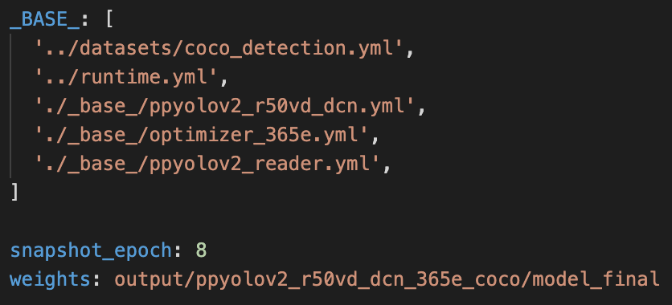

## Install Requirements:

- PaddlePaddle 2.1
- OS 64 bit
- Python 3(3.5.1+/3.6/3.7/3.8/3.9)，64 bit
- pip/pip3(9.0.1+), 64 bit
- CUDA >= 10.1
- cuDNN >= 7.6

## Install PaddleDetection

```bash
# Clone PaddleDetection repository
cd <path/to/clone/PaddleDetection>
git clone https://github.com/PaddlePaddle/PaddleDetection.git

cd PaddleDetection
# Install other dependencies
pip install -r requirements.txt
```

## Prepare Dataset

Download [PubLayNet](https://github.com/ibm-aur-nlp/PubLayNet)：

```bash
cd PaddleDetection/dataset/
mkdir publaynet
# download dataset
wget https://dax-cdn.cdn.appdomain.cloud/dax-publaynet/1.0.0/publaynet.tar.gz?_ga=2.104193024.1076900768.1622560733-649911202.1622560733

tar -xvf publaynet.tar.gz
```

Folder structure：

| File or Folder | Description                                      | num     |
| :------------- | :----------------------------------------------- | ------- |
| `train/`       | Images in the training subset                    | 335,703 |
| `val/`         | Images in the validation subset                  | 11,245  |
| `test/`        | Images in the testing subset                     | 11,405  |
| `train.json`   | Annotations for training images                  |         |
| `val.json`     | Annotations for validation images                |         |
| `LICENSE.txt`  | Plaintext version of the CDLA-Permissive license |         |
| `README.txt`   | Text file with the file names and description    |         |

## Modify Config Files

Use `configs/ppyolo/ppyolov2_r50vd_dcn_365e_coco.yml` config for training：

<div align='center'>
  
</div>


From the figure above, `ppyolov2_r50vd_dcn_365e_coco.yml` the config depends on other config files:

```
coco_detection.yml：mainly explains the path of training data and verification data

runtime.yml：describes common runtime parameters, such as whether to use a GPU, and how many Epoch checkpoints to store per Epoch,etc.

optimizer_365e.yml：mainly explains learning rate and optimizer.

ppyolov2_r50vd_dcn.yml：mainly explains the model, and the trunk network.

ppyolov2_reader.yml：mainly explains the configuration of data reader, such as batch size, number of concurrent loading child processes, etc, and post-read preprocessing operations, such as resize, data enhancement, etc
```

You will need to modify the above configuration file  according to the actual situation.

## Train

* Perform evaluation in training

```bash
export CUDA_VISIBLE_DEVICES=0,1,2,3
python -m paddle.distributed.launch --gpus 0,1,2,3 tools/train.py -c configs/ppyolo/ppyolov2_r50vd_dcn_365e_coco.yml --eval
```

Notice: If you encounter "`Out of memory error`" problem, try reducing  batch size  in `ppyolov2_reader.yml` file.

* Fine-tune other task

When using pre-trained model to fine-tune other task, pretrain_weights can be used directly. The parameters with different shape will be ignored automatically. For example:

```bash
export CUDA_VISIBLE_DEVICES=0,1,2,3
# If the shape of parameters in program is different from pretrain_weights,
# then PaddleDetection will not use such parameters.
python -m paddle.distributed.launch --gpus 0,1,2,3 tools/train.py -c configs/ppyolo/ppyolov2_r50vd_dcn_365e_coco.yml \
                         -o pretrain_weights=output/ppyolov2_r50vd_dcn_365e_coco/model_final \
```

## Inference

- Output specified directory && Set up threshold

```
export CUDA_VISIBLE_DEVICES=0
python tools/infer.py -c configs/ppyolo/ppyolov2_r50vd_dcn_365e_coco.yml \
                    --infer_img=demo/000000570688.jpg \
                    --output_dir=infer_output/ \
                    --draw_threshold=0.5 \
                    -o weights=output/ppyolov2_r50vd_dcn_365e_coco/model_final \
                    --use_vdl=Ture
```

`--draw_threshold` is an optional argument. Default is 0.5. Different thresholds will produce different results depending on the calculation of [NMS](https://ieeexplore.ieee.org/document/1699659).

## Inference and deployment

### Export model for inference

```bash
python tools/export_model.py -c configs/ppyolo/ppyolov2_r50vd_dcn_365e_coco.yml --output_dir=./inference \
 -o weights=output/ppyolov2_r50vd_dcn_365e_coco/model_final.pdparams
```

* -c：config file
* --output_dir：model save dir

The prediction model is exported to the directory 'inference/ppyolov2_r50vd_dcn_365e_coco', respectively:`infer_cfg.yml`, `model.pdiparams`, `model.pdiparams.info`, `model.pdmodel`

More Info：https://github.com/PaddlePaddle/PaddleDetection/blob/release/2.1/deploy/EXPORT_MODEL.md

### Python inference

```bash
python deploy/python/infer.py --model_dir=./inference/ppyolov2_r50vd_dcn_365e_coco --image_file=./demo/road554.png --use_gpu=True
```

* --model_dir：the previous step exported  model dir
* --image_file：inference image name 
* --use_gpu：whether use gpu

More Info：https://github.com/PaddlePaddle/PaddleDetection/tree/release/2.1/deploy/python

C++ infernece：https://github.com/PaddlePaddle/PaddleDetection/blob/release/2.1/deploy/cpp

