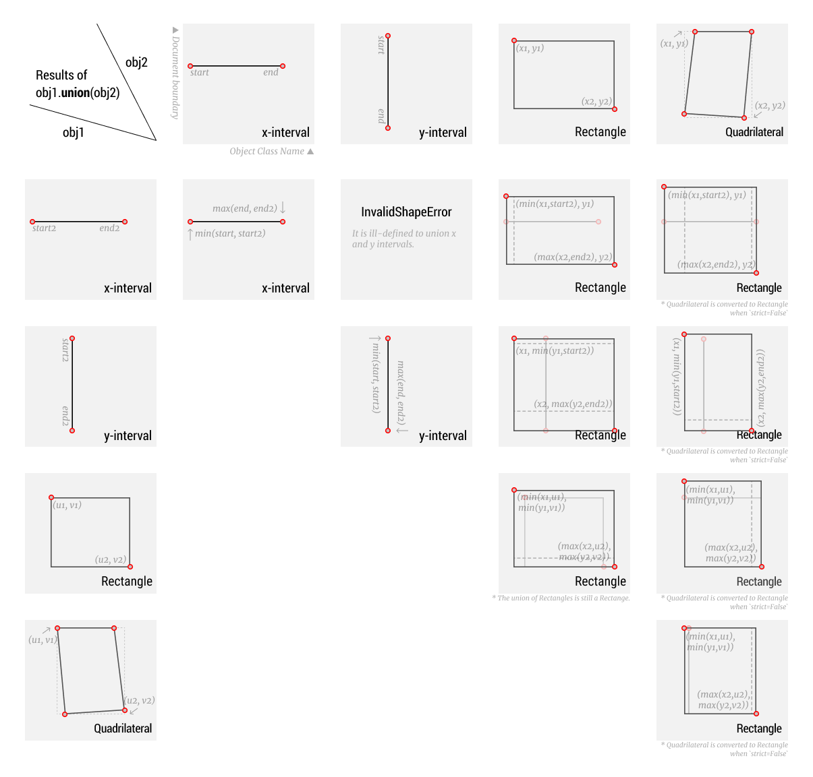
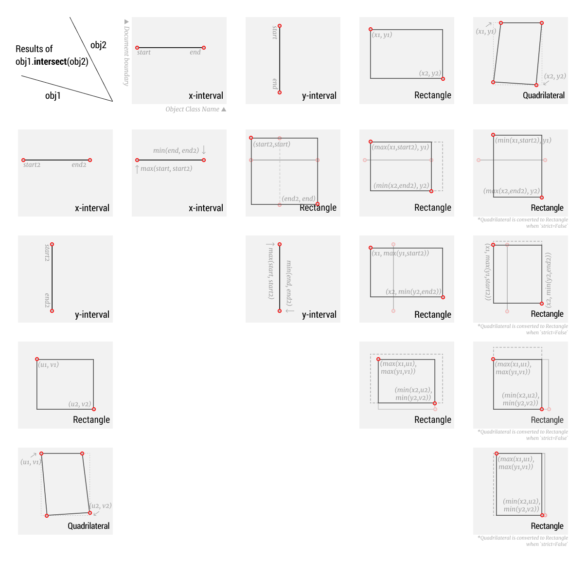

# Shape Operations 

[BETA: the API and behavior *will* be changed in the future.]

Starting from v0.2, Layout Parser provides supports for two types of shape operations, `union` and `intersection`, across all `BaseCoordElement`s and `TextBlock`. We've made some design choices to construct a set of generalized APIs across different shape classes, detailed as follows:

## The `union` Operation

▲ The Illustration of Union Operations. The resulting matrix are symmetric so only the lower triangular region is left empty. Each cell shows the visualization of the shape objects, their coordinates, and their object class. For the output visualization, the gray and dashed line delineates the original obj1 and obj2, respectively, for reference. 

**Notes**: 
1. The x-interval and y-interval are both from the `Interval` Class but with different axes. It's ill-defined to union two intervals from different axes so in this case Layout Parser will raise an `InvalidShapeError`.
2. The union of two rectangles is still a rectangle, which is the minimum covering rectangle of the two input rectangles.
3. For the outputs associated with `Quadrilateral` inputs, please see details in the [Problems related to the Quadrilateral Class](#problems-related-to-the-quadrilateral-class) section.

## The `intersect` Operation

▲ The Illustration of Union Operations. Similar to the previous visualization, the resulting matrix are symmetric so only the lower triangular region is left empty. Each cell shows the visualization of the shape objects, their coordinates, and their object class. For the output visualization, the gray and dashed line delineates the original obj1 and obj2, respectively, for reference. 

## Problems related to the `Quadrilateral` Class

It is possible to generate arbitrary shapes when performing shape operations on `Quadrilateral` objects. Currently Layout Parser does not provide the support for `Polygon` objects (but we plan to support that object in the near future), thus it becomes tricky to add support for these operations for `Quadrilateral`. The temporary solution is that: 
1. When performing shape operations on `Quadrilateral` objects, Layout Parser will raise `NotSupportedShapeError`.
2. A workaround is to set `strict=False` in the input (i.e., `obj1.union(obj2, strict=False)`). In this case, any quadrilateral objects will be converted to `Rectangle`s first and the operation is executed. The results may not be *strictly* equivalent to those performed on the original objects. 